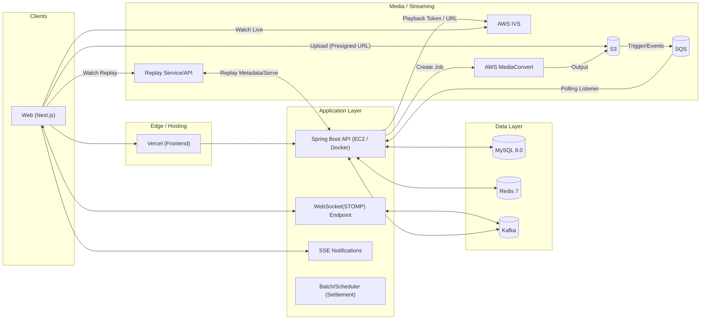
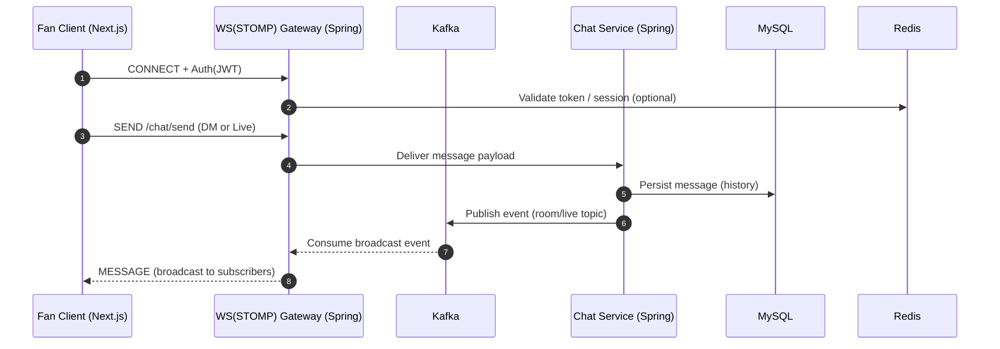
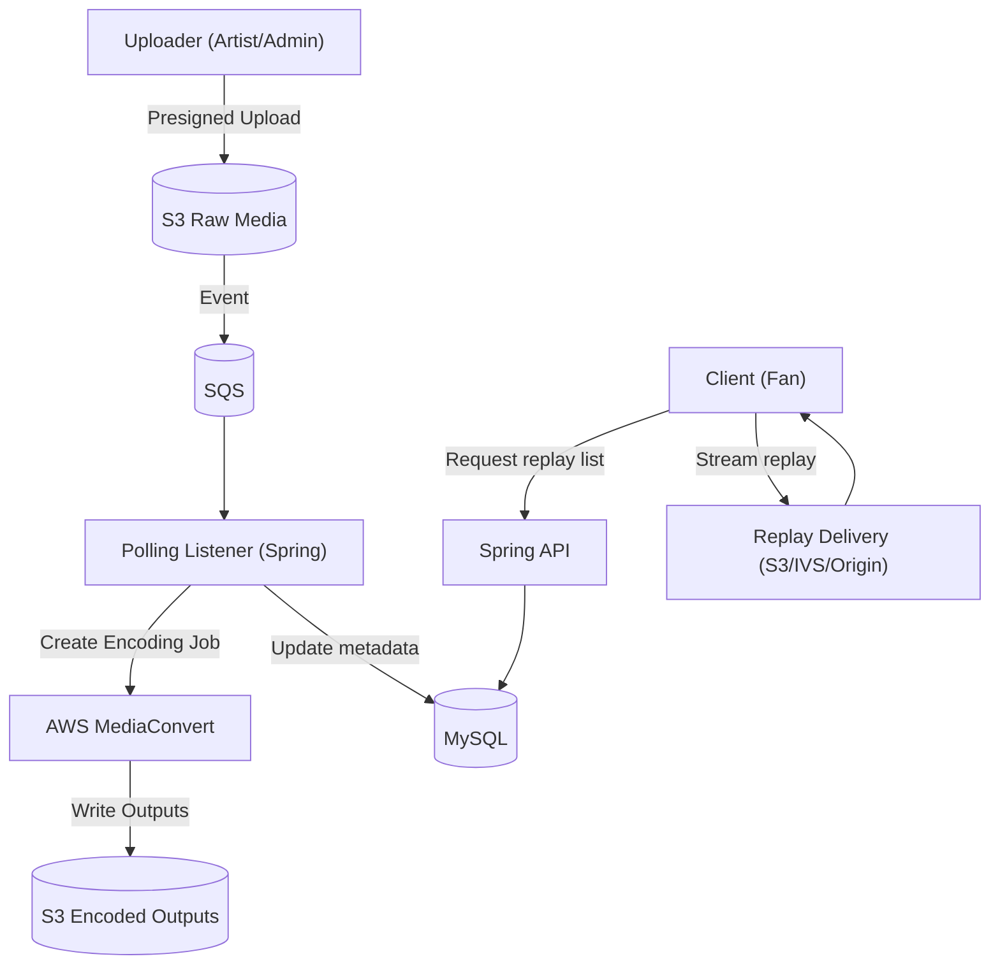

<div align="center">
  <h1>FanLink</h1>
  <p><strong>아티스트와 팬을 하나로 연결하는 All-in-One 팬 커뮤니티 플랫폼</strong></p>
  <p>
    인증/인가 · 실시간 채팅 · 라이브/리플레이 · 결제/구독 · 주문/배송 · 정산을 하나의 사용자 여정으로 통합한 서비스입니다.
  </p>
</div>

<div align="center">


</div>

---

## 목차

- [프로젝트 소개](#프로젝트-소개)
- [팀 구성](#팀-구성)
- [기술 스택](#기술-스택)
- [주요 기능 (Actor 기반)](#주요-기능-actor-기반)
- [시스템 아키텍처](#시스템-아키텍처)
- [ERD](#erd)
- [프로젝트 구조](#프로젝트-구조)
- [설치 및 실행 방법](#설치-및-실행-방법)
- [.env 예시](#env-예시)

---

## 프로젝트 소개

FanLink는 팬과 아티스트의 상호작용을 콘텐츠 소비에서 비즈니스 운영까지 확장한 통합 플랫폼입니다.

| 사용자       | 핵심 가치                          | 대표 기능                                                          |
| ------------ | ---------------------------------- | ------------------------------------------------------------------ |
| Fan          | 콘텐츠 소비 + 커뮤니티 참여 + 구매 | 팔로우, 게시글/댓글/좋아요, DM, 라이브 시청, 결제/배송, 마이페이지 |
| Artist/Group | 콘텐츠 운영 + 상거래 운영 + 정산   | 아티스트 콘솔, 라이브 세션, 상품/주문/배송 관리, 정산 조회         |
| Admin        | 운영 통제 + 리스크 관리            | 회원/아티스트 관리, 신고/패널티 처리, 정산 배치 실행               |

---

## 팀 구성

| 이름   | 역할               | 담당 도메인                               | 코드 기준 패키지/경로                                                                                                                                               |
| ------ | ------------------ | ----------------------------------------- | ------------------------------------------------------------------------------------------------------------------------------------------------------------------- |
| 최형규 | Lead / 보안        | 인증/인가 총괄, JWT, OAuth2               | `backend/src/main/java/org/example/backend/global/security`, `backend/src/main/java/org/example/backend/user`                                                       |
| 박혜은 | RM / 보안 / 인프라 | 보안 정책, 배포/운영 환경 구성            | `backend/src/main/java/org/example/backend/global/config`, `docker-compose.yml`, `.github/workflows/deploy.yml`                                                     |
| 강우연 | RM / 채팅 / 콘텐츠 | 실시간 채팅, 라이브/리플레이, 콘텐츠 흐름 | `backend/src/main/java/org/example/backend/chat`, `backend/src/main/java/org/example/backend/live_session`, `backend/src/main/java/org/example/backend/replay`      |
| 박나현 | SA / 채팅          | DM/라이브 채팅 아키텍처 및 메시지 처리    | `backend/src/main/java/org/example/backend/chat`                                                                                                                    |
| 김태환 | SM / 정산          | 정산 대시보드/배치/복구 로직              | `backend/src/main/java/org/example/backend/settlement`                                                                                                              |
| 양민섭 | IO / 인프라        | AWS 미디어/라이브 파이프라인              | `backend/src/main/java/org/example/backend/ivs`, `backend/src/main/java/org/example/backend/media_asset`, `backend/src/main/java/org/example/backend/replay/config` |
| 양승민 | PO / 결제          | Toss 결제, 주문/구독 연동                 | `backend/src/main/java/org/example/backend/payment`, `backend/src/main/java/org/example/backend/order`, `backend/src/main/java/org/example/backend/subscription`    |

---

## 기술 스택

### Backend

| 스택                         | 사용 목적 (코드 근거)                                                                                                                                                                                      |
| ---------------------------- | ---------------------------------------------------------------------------------------------------------------------------------------------------------------------------------------------------------- |
| Java 21                      | 백엔드 실행 환경 (`backend/build.gradle` toolchain `JavaLanguageVersion.of(21)`)                                                                                                                           |
| Spring Boot 3.5.10           | REST API, 보안, 스케줄러, 배치 기반 앱 구성 (`backend/build.gradle`)                                                                                                                                       |
| Spring Security, JWT, OAuth2 | 역할 기반 인증/인가 및 소셜 로그인 (`global/config/SecurityConfig.java`, `global/security/jwt/*`, `global/security/oauth2/*`)                                                                              |
| Spring Data JPA              | 도메인 영속화 및 엔티티 관계 매핑 (`user/entity/User.java`, `order/entity/Order.java`, `payment/entity/Payment.java`)                                                                                      |
| QueryDSL                     | 현재 레포 기준 `JPAQueryFactory` 사용 코드 미확인 (확장 여지)                                                                                                                                              |
| Redis                        | Refresh Token, OAuth 코드, 인증코드/Rate Limit 저장 (`global/security/jwt/RefreshTokenStore.java`, `global/security/oauth2/OAuthAuthorizationCodeStore.java`, `user/service/VerificationCodeService.java`) |
| Kafka                        | DM/라이브 채팅 메시지 비동기 브로드캐스트 (`chat/config/KafkaConfig.java`, `chat/config/LiveKafkaConfig.java`, `chat/service/ChatService.java`)                                                            |
| Spring Batch                 | 월 정산 배치 및 수동 실행 (`settlement/batch/SettlementBatchConfig.java`, `settlement/batch/SettlementScheduler.java`)                                                                                     |

### Frontend

| 스택                  | 사용 목적 (코드 근거)                                                                |
| --------------------- | ------------------------------------------------------------------------------------ |
| Next.js 16 + React 19 | App Router 기반 화면 라우팅 및 UI 구성 (`frontend/package.json`, `frontend/app/**`)  |
| Tailwind CSS 4        | 공통 UI 디자인 시스템 스타일링 (`frontend/package.json`, `frontend/app/globals.css`) |
| Axios + Fetch Wrapper | API 호출 표준화 및 토큰 자동 재발급 (`frontend/lib/api.js`)                          |
| STOMP + SockJS        | DM/라이브 실시간 메시징 (`frontend/app/dm/**`, `frontend/app/live/[id]/page.js`)     |
| Toss Payments SDK     | 굿즈 결제/구독 결제 연동 (`frontend/app/checkout/page.js`)                           |
| React Query           | 현재 레포 기준 사용 코드 미확인 (확장 여지)                                          |
| Zustand               | 현재 레포 기준 사용 코드 미확인 (확장 여지)                                          |

### Infra / Cloud

| 스택                       | 사용 목적 (코드 근거)                                                                                                         |
| -------------------------- | ----------------------------------------------------------------------------------------------------------------------------- |
| AWS IVS                    | 라이브 재생 URL/토큰 발급 (`ivs/controller/IvsPlaybackTokenController.java`, `ivs/service/IvsPlaybackTokenService.java`)      |
| AWS S3                     | 미디어 Presign 업로드 및 오브젝트 검증/삭제 (`media_asset/service/S3MediaClient.java`)                                        |
| AWS SQS                    | IVS/MediaConvert 이벤트 폴링 처리 (`ivs/event/IvsRecordingEventListener.java`, `replay/event/MediaConvertEventListener.java`) |
| AWS MediaConvert           | 리플레이 인코딩 Job 생성 (`replay/service/MediaConvertJobService.java`)                                                       |
| EC2 + ECR + GitHub Actions | 백엔드 이미지 빌드/푸시/배포 자동화 (`.github/workflows/deploy.yml`)                                                          |

---

## 주요 기능 (Actor 기반)

<details open>
<summary><strong>Fan</strong></summary>

- 인증/계정: 이메일·휴대폰 인증 회원가입, OAuth 로그인, 토큰 재발급, 회원탈퇴
- 커뮤니티: 아티스트 팔로우, 팬 게시글/댓글/좋아요, 신고
- 실시간: DM 채팅, 라이브 채팅(WebSocket + Kafka), 알림(SSE)
- 결제/배송: 주문 생성, Toss 결제, 구독 결제, 배송 상태/이력 조회
- 팬 성장: 마일스톤(팬 등급), 티켓 QR 조회/검증

대표 API:
`POST /api/auth/signup`, `POST /api/auth/oauth/exchange`, `POST /api/user/follow/{artistId}`, `GET /api/chat/DM/rooms`, `POST /api/orders`, `GET /api/deliveries/{deliveryId}`, `GET /api/tickets/my`

</details>

<details open>
<summary><strong>Artist / Group</strong></summary>

- 아티스트 콘솔: 홈/KPI 대시보드, 프로필 편집, 콘서트 관리
- 콘텐츠 운영: 아티스트 게시글 작성, 라이브 세션 생성/종료, 리플레이 발행
- 비즈니스 운영: 상품 등록/수정, 주문/배송 관리, 정산 조회

대표 API:
`GET /api/artist/dashboard/summary`, `POST /api/live-sessions`, `POST /api/artist-posts`, `POST /api/products`, `GET /api/orders/artist-console`, `POST /api/deliveries/{deliveryId}/start`, `GET /api/settlements/history`

</details>

<details open>
<summary><strong>Admin</strong></summary>

- 운영 관리: 회원/아티스트 목록, 아티스트 계정 생성, 패널티 부여
- 모니터링/통제: 신고 처리, 정산 실패 로그 조회, 수동 정산 배치 실행

대표 API:
`GET /api/admin/users`, `POST /api/admin/artists`, `POST /api/admin/penalties`, `GET /api/admin/mypage/reports`, `GET /api/settlements/admin/failure-logs`, `POST /api/settlements/admin/execute`

</details>

---

## 시스템 아키텍처



### 실시간 채팅 메시지 흐름 (DM/Live)



### 리플레이 인코딩 파이프라인



아키텍처 요약:

- 클라이언트: Next.js
- API 서버: Spring Boot
- 인증/인가: JWT + OAuth2
- 실시간 메시징: WebSocket(STOMP) + Kafka
- 데이터 계층: MySQL(영속 데이터), Redis(토큰/인증 코드/캐시)
- 미디어 계층: S3 업로드 → MediaConvert 인코딩 → Replay 제공
- 라이브 계층: AWS IVS + Playback Token
- 이벤트 후처리: SQS Polling

---

## ERD


핵심 관계:

- `User` 1:N `Follow`
- `Order` 1:N `OrderItem`
- `Order` 1:1 `Delivery`
- `Payment` N:1 `Order`
- `Subscription` N:1 `Product`
- `Settlement` 1:N `SettlementDetail`
- `Ticket`는 주문/상품/공연 식별자를 참조해 발급/검증

---

## 프로젝트 구조

```text
FanLinkProject/
├─ backend/
│  ├─ src/main/java/org/example/backend/
│  │  ├─ global/         # 공통 설정, 보안, 예외 처리
│  │  ├─ user/           # 인증/회원/아티스트/관리자
│  │  ├─ chat/           # DM/라이브 채팅, Kafka/WebSocket
│  │  ├─ live_session/   # 라이브 세션 도메인
│  │  ├─ replay/         # 다시보기 생성/발행, MediaConvert 이벤트
│  │  ├─ media_asset/    # S3 presign/complete, 미디어 메타데이터
│  │  ├─ product/        # 상품/마켓
│  │  ├─ order/          # 주문 생성 및 아티스트 주문 콘솔
│  │  ├─ payment/        # Toss 결제 승인/실패 처리
│  │  ├─ delivery/       # 배송 조회/송장 입력/웹훅
│  │  ├─ subscription/   # 멤버십 구독
│  │  ├─ settlement/     # 정산 배치/대시보드/관리자 기능
│  │  ├─ ticket/         # QR 티켓 발급/검증
│  │  └─ milestone/      # 팬 등급/활동 지표
│  └─ src/main/resources/application.yml
├─ frontend/
│  ├─ app/               # Next.js App Router 페이지
│  │  ├─ artist-console/ # 아티스트 콘솔
│  │  ├─ mypage/         # 팬/아티스트 마이페이지
│  │  ├─ market/         # 마켓/상품 상세
│  │  ├─ live/           # 라이브 시청
│  │  ├─ dm/             # DM 채팅
│  │  ├─ checkout/       # 결제 진입
│  │  └─ admin/          # 관리자 페이지
│  ├─ components/        # 공통 UI/레이아웃/사이드바/IVS 플레이어
│  └─ lib/               # API 클라이언트/도메인별 API 모듈
├─ docker-compose.yml    # MySQL/Redis/Kafka/Zookeeper/Backend 구성
├─ .github/workflows/deploy.yml
├─ .env.example
└─ readme.md
```

---

## 설치 및 실행 방법

### 1) 사전 요구사항

- Java 21
- Node.js 18+
- Docker / Docker Compose

### 2) 환경 변수 준비

```bash
cp .env.example .env
```

- `.env`에 DB, OAuth, JWT, Redis, AWS, 결제 관련 값을 환경에 맞게 입력합니다.
- 실제 시크릿 값은 저장소에 커밋하지 않습니다.

### 3) 인프라 실행 (MySQL, Redis, Kafka)

```bash
docker compose up -d db redis zookeeper kafka
docker compose ps
```

### 4) 백엔드 실행

```bash
cd backend
./gradlew bootRun
```

Windows:

```bash
cd backend
gradlew.bat bootRun
```

헬스체크:

```bash
curl http://localhost:8080/actuator/health
```

### 5) 프론트엔드 실행

```bash
cd frontend
npm install
npm run dev
```

- 접속: `http://localhost:3000`
- 배포 전 빌드 검증:

```bash
npm run build
npm run start
```

### 6) 종료

```bash
docker compose down
```

---

## .env 예시

- 루트의 `.env.example` 파일을 기준으로 로컬/배포 환경 변수를 구성합니다.
- Vercel 환경에는 최소 `NEXT_PUBLIC_API_BASE_URL`을 설정합니다.

---
