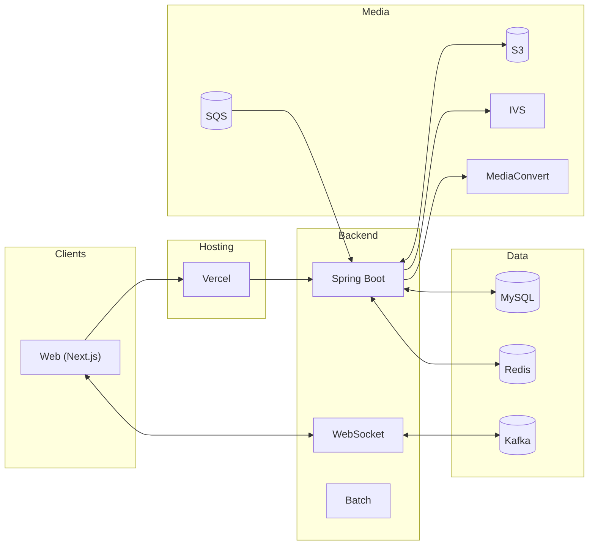
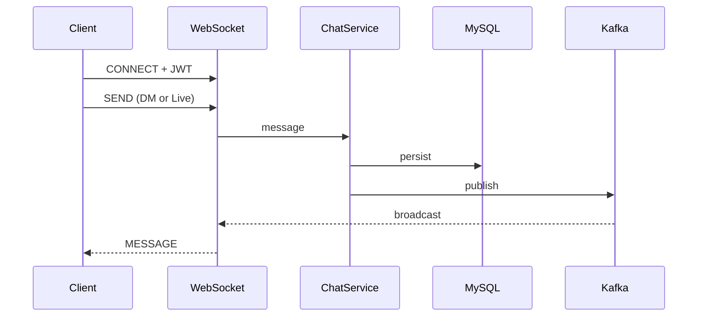

# FanLink - 아티스트·팬 통합 플랫폼

<div align="center">


**인증·실시간 채팅·라이브/다시보기·결제/구독·주문/배송·정산을 하나의 사용자 여정으로 통합한 All-in-One 팬 커뮤니티**

[소개](#-프로젝트-소개) • [기능](#-주요-기능) • [아키텍처](#-시스템-아키텍처) • [기술 스택](#-기술-스택) • [시작하기](#-시작하기) • [배포](#-배포)

</div>

---

## 📋 프로젝트 소개

FanLink는 **팬과 아티스트**의 상호작용을 콘텐츠 소비에서 비즈니스 운영까지 한 플랫폼에서 지원하는 서비스입니다.

### 🎯 핵심 가치

| 사용자 | 핵심 가치 | 대표 기능 |
|--------|-----------|-----------|
| **Fan** | 콘텐츠 소비 + 커뮤니티 + 구매 | 팔로우, 게시글/댓글/좋아요, DM, **라이브 시청**, 결제/배송, 마이페이지 |
| **Artist / Group** | 콘텐츠 운영 + 상거래 + 정산 | 아티스트 콘솔, **라이브 세션·다시보기 발행**, 상품/주문/배송, 정산 조회 |
| **Admin** | 운영 통제 + 리스크 관리 | 회원/아티스트 관리, 신고/패널티, 정산 배치 실행 |

### 👥 팀 구성

| 이름 | 역할 | 담당 도메인 |
|------|------|-------------|
| 최형규 | Lead / 보안 | 인증·인가, JWT, OAuth2 |
| 박혜은 | RM / 보안·인프라 | 보안 정책, **Vercel(프론트 배포)** |
| 강우연 | RM / 채팅·콘텐츠 | 실시간 채팅, 라이브/리플레이, 콘텐츠 흐름 |
| 박나현 | SA / 채팅 | DM·라이브 채팅 아키텍처 |
| 김태환 | SM / 정산 | 정산 대시보드·배치·복구 |
| 양민섭 | IO / 인프라 | **EC2, OIDC, GitHub Actions(백엔드 CI/CD)** · IVS, replay, media_asset, music_video · AWS 미디어/라이브 파이프라인 |
| 양승민 | PO / 결제 | Toss 결제, 주문/구독 연동 |

---

## ✨ 주요 기능

### 👤 Fan

| 영역 | 기능 |
|------|------|
| 인증/계정 | 이메일·휴대폰 인증 회원가입, OAuth 로그인, 토큰 재발급, 회원탈퇴 |
| 커뮤니티 | 팔로우, 팬 게시글/댓글/좋아요, 신고 |
| 실시간 | DM 채팅, **라이브 채팅**(WebSocket + Kafka), 알림(SSE) |
| 결제/배송 | 주문 생성, Toss 결제, 구독 결제, 배송 상태/이력 조회 |
| 팬 성장 | 마일스톤(팬 등급), 티켓 QR 조회/검증 |

### 🎤 Artist / Group

| 영역 | 기능 |
|------|------|
| 콘솔 | 홈/KPI 대시보드, 프로필·커버 편집, 콘서트 관리 |
| 콘텐츠 | 아티스트 게시글, **라이브 세션 생성/종료**, **다시보기·뮤직비디오 발행** |
| 비즈니스 | 상품 등록/수정, 주문/배송 관리, 정산 조회 |

### ⚙️ Admin

| 영역 | 기능 |
|------|------|
| 운영 | 회원/아티스트 목록, 아티스트 계정 생성, 패널티 부여 |
| 모니터링 | 신고 처리, 정산 실패 로그, 수동 정산 배치 실행 |

---

## 🏗 시스템 아키텍처

### 전체 구성

```
┌─────────────────────────────────────────────────────────────────────────┐
│                         Client (Next.js + React 19)                       │
│                    Vercel · App Router · Tailwind v4                      │
└───────────────────────────────┬─────────────────────────────────────────┘
                                │
              ┌─────────────────┼─────────────────┐
              │                 │                 │
              ▼                 ▼                 ▼
         REST API          WebSocket           HLS / IVS
         (JWT/OAuth2)       (STOMP+SockJS)      (라이브·다시보기)
              │                 │                 │
              └─────────────────┼─────────────────┘
                                │
┌───────────────────────────────▼─────────────────────────────────────────┐
│                    Spring Boot Backend (EC2 / Docker)                    │
│  ┌────────────┐ ┌────────────┐ ┌────────────┐ ┌────────────┐            │
│  │  REST API  │ │ WebSocket  │ │ Scheduler  │ │   Batch    │            │
│  │ Controller │ │  (STOMP)   │ │ (Settlement)│ │ (Settlement)│            │
│  └─────┬──────┘ └─────┬─────┘ └─────┬──────┘ └─────┬──────┘            │
│        └───────────────┴─────────────┴──────────────┘                    │
│                              Service Layer                               │
└─────────────────────────────────┬───────────────────────────────────────┘
                                  │
     ┌────────────────────────────┼────────────────────────────┐
     │                            │                            │
     ▼                            ▼                            ▼
┌─────────┐                 ┌──────────┐              ┌───────────────┐
│ MySQL   │                 │   AWS    │              │ Toss Payments │
│ Redis   │                 │ IVS·S3   │              │ Kafka (Chat)  │
│ Kafka   │                 │ SQS·MC   │              │               │
└─────────┘                 │ CloudFront│              └───────────────┘
                            └──────────┘
```

### 라이브·다시보기 파이프라인

- **라이브**: AWS IVS 실시간 스트림 + Playback Token 발급 → 자동 녹화 S3 → EventBridge → SQS → Replay 생성
- **수동 다시보기**: Presign 업로드 S3 → MediaConvert Job → EventBridge → SQS → Replay READY
- **재생**: CloudFront Signed URL/Cookie · Key Group 기반 비공개 스트리밍

<details>
<summary>Mermaid 다이어그램 펼치기</summary>

**시스템 개요**



**실시간 채팅 (DM / Live)**



</details>

---

## 🛠 기술 스택

### Frontend

| 구분 | 기술 |
|------|------|
| Framework | Next.js 16 (App Router), React 19 |
| Styling | Tailwind CSS v4 |
| API | Fetch Wrapper, 토큰 자동 재발급 (`lib/api.js`) |
| 실시간 | STOMP + SockJS (DM/라이브 채팅) |
| 결제 | Toss Payments SDK |
| 영상 | hls.js (다시보기 HLS) |

### Backend

| 구분 | 기술 |
|------|------|
| Framework | Spring Boot 3.5.x, Java 21 |
| Data | MySQL 8.0, Spring Data JPA |
| Security | Spring Security, JWT, OAuth2 (Kakao/Google/Naver 등) |
| 실시간 | Spring WebSocket (STOMP), Kafka |
| Batch | Spring Batch (정산) |
| Cache / 기타 | Redis (Refresh Token, OAuth 코드, Rate Limit) |

### Infra / AWS

| 구분 | 기술 |
|------|------|
| 라이브 | AWS IVS (실시간 스트리밍, 자동 녹화) |
| 스토리지·CDN | S3, CloudFront (Signed URL/Cookie) |
| 인코딩 | AWS MediaConvert (수동 업로드 HLS) |
| 이벤트 | EventBridge, SQS (IVS/MediaConvert 이벤트) |
| 배포 | GitHub Actions, ECR, SSM (OIDC 무키 배포), EC2, Docker |

---

## 🚀 시작하기

### 사전 요구사항

- Java 21  
- Node.js 18+  
- Docker & Docker Compose  
- MySQL 8.0, Redis, Kafka (로컬은 Docker 권장)

### 환경 변수

```bash
cp .env.example .env
```

- `.env`에 DB, OAuth, JWT, Redis, AWS, 결제 등 값을 입력합니다.  
- 시크릿은 저장소에 커밋하지 않습니다.  
- Vercel에는 최소 `NEXT_PUBLIC_API_BASE_URL` 설정.

### 로컬 실행

#### Option 1: Docker Compose (권장)

```bash
# MySQL, Redis, Kafka, Zookeeper 기동
docker compose up -d db redis zookeeper kafka
docker compose ps
```

#### Option 2: 백엔드만 Docker

```bash
docker compose up -d db redis zookeeper kafka
cd backend && ./gradlew bootRun
```

#### Frontend

```bash
cd frontend
npm install
npm run dev
```

### 접속

| 대상 | URL |
|------|-----|
| Frontend | http://localhost:3000 |
| Backend API | http://localhost:8080 |
| Health | http://localhost:8080/actuator/health |

### 종료

```bash
docker compose down
```

---

## 📖 API 요약

### 인증·회원

| Method | Endpoint | 설명 |
|--------|----------|------|
| POST | `/api/auth/signup` | 회원가입 |
| POST | `/api/auth/login` | 로그인 |
| POST | `/api/auth/refresh` | 토큰 재발급 |
| POST | `/api/auth/oauth/exchange` | OAuth 토큰 교환 |

### 라이브·다시보기

| Method | Endpoint | 설명 |
|--------|----------|------|
| POST | `/api/ivs/playback-token` | IVS 재생 토큰 발급 |
| GET | `/api/replays` | 아티스트별 다시보기 목록 |
| GET | `/api/replays/candidates` | 발행 후보 목록 (아티스트) |
| POST | `/api/replays/publish` | 다시보기 발행 |
| POST | `/api/replays/{id}/access` | 재생 접근 게이트 (Signed Cookie/파라미터) |

### WebSocket 토픽

| Topic | 설명 |
|-------|------|
| `/sub/chat/dm/{roomId}` | DM 채팅 |
| `/sub/live/{liveSessionId}` | 라이브 채팅 |
| `/sub/live/global` | 라이브 목록 변경 알림 |

> 도메인별 상세 스펙은 `backend/.../ivs/README.md`, `replay/README.md`, `media_asset/README.md`, `music_video/README.md` 참고.

---

## 🚢 배포

### Backend (EC2 · GitHub Actions · OIDC)

- **담당**: 인프라(EC2, OIDC, GitHub Actions)  
- **트리거**: `dev` 브랜치 push  
- **흐름**: Checkout → **OIDC**로 AWS 임시 자격증명 → Docker Build → ECR Push → **SSM send-command**로 EC2에서 `deploy.sh` 실행  
- **특징**: Access Key 없이 GitHub OIDC + IAM Role만 사용, SSH/PEM 불필요

### Frontend (Vercel)

- **담당**: Vercel 배포 환경 구성

### 필요한 Secrets (Backend 배포)

| Secret | 용도 |
|--------|------|
| `AWS_REGION` | 리전 |
| `EC2_INSTANCE_ID` | SSM 대상 인스턴스 |
| `ECR_URI` | ECR 저장소 URI |
| `GHA_DEPLOY_ROLE_ARN` | OIDC Assume Role ARN |

### EC2 측

- SSM Agent 설치  
- `/opt/fanlink/deploy.sh`, `docker-compose.yml`, `.env` 등 배포에 필요한 파일 구성

---

## 📁 프로젝트 구조

```
FanLinkProject/
├── backend/
│   └── src/main/java/org/example/backend/
│       ├── global/          # 보안, 예외, 공통 설정
│       ├── user/            # 인증, 회원, 아티스트, 관리자
│       ├── chat/            # DM·라이브 채팅 (Kafka, WebSocket)
│       ├── live_session/    # 라이브 세션
│       ├── replay/         # 다시보기 (발행, Access Gate, MediaConvert 이벤트)
│       ├── ivs/            # IVS Playback Token
│       ├── media_asset/    # S3 Presign/Complete, 미디어 메타
│       ├── music_video/    # 뮤직비디오 (YouTube)
│       ├── product/        # 상품
│       ├── order/          # 주문
│       ├── payment/        # Toss 결제
│       ├── delivery/       # 배송
│       ├── subscription/   # 구독
│       ├── settlement/     # 정산 배치·대시보드
│       ├── ticket/         # 티켓 QR
│       └── milestone/      # 팬 등급
├── frontend/
│   ├── app/                # App Router (artist-console, mypage, live, dm, checkout, admin 등)
│   ├── components/         # 공통 UI, IVS 플레이어
│   └── lib/                # api.js, replayApi, mediaAssetApi, ivsApi 등
├── docs/                   # ERD, 인프라 PPT 등
├── docker-compose.yml
├── .github/workflows/deploy.yml
└── .env.example
```

### ERD

- 이미지: [docs/images/erd.png](docs/images/erd.png)  
- 핵심: User–Follow, Order–OrderItem–Delivery, Payment, Subscription, Settlement, Ticket 등

---

## 📄 라이선스

This project is licensed under the MIT License.

---

<div align="center">

**FanLink** — 아티스트와 팬을 하나로 연결하는 All-in-One 팬 커뮤니티

</div>
